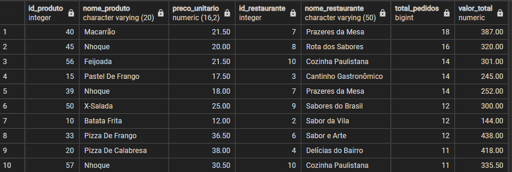
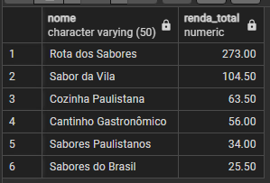
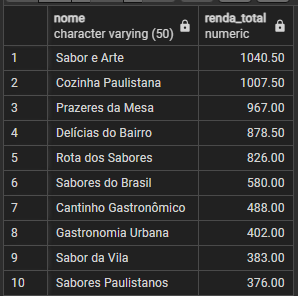
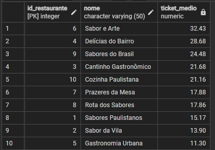
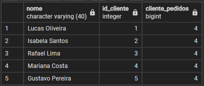

# Modelagem e criação de banco de dados com PostgreSQL para a "DeliFoods"🍔

Este é um projeto desenvolvido para o módulo de Modelagem de Banco de Dados para o Curso de Análise de Dados da Ada.tech, em parceria com o Ifood. Nele, fomos desafiados a escolher um modelo de negócio, e agir como uma consultoria de tecnologia contratada para estruturar um banco de dados completo utilizando PostgreSQL

# Integrantes do projeto 👥
- [Alan Gonçalves](https://github.com/alansgoncalves)
- [Élen Silva Almeida](https://github.com/Lely0sa)
- [Gabriel Matina](https://github.com/gabrielmatina)
- [Gustavo Dell Anhol Oliveira](https://github.com/gudaoliveira)
- [Patrick Kwan](https://github.com/ptkwan)

## BRIEFING 📋

👉 _[Clique aqui para ler o briefing do projeto](https://github.com/gudaoliveira/delicia-foods_modelagem_banco_de_dados/blob/main/briefing.md)_

*DeliFoods, um negócio inovador que conecta os amantes da culinária local aos seus restaurantes favoritos de uma maneira mais fácil e eficiente.*

*Cada restaurante, desde os clientes até os detalhes dos pedidos são registrados minuciosamente, e os produtos deliciosos são catalogados para garantir uma experiência de pedidos fluida e sem complicações.*

## MODELAGEM DE DADOS 🗂️

O primeiro passo foi entender qual seria a necessidade do cliente, quais seriam os processos e o fluxo dos dados na plataforma, assim, conseguimos definir quais seriam as entidades e seus atributos no nosso banco de dados, para isso temos que ter em mente o seguinte:

> Cada restaurante tem seu id próprio
    
> Cada pedido tem seu id próprio, e referencia tanto o restaurante em que foi realizado quanto ao cliente que realizou

> Cada restaurante cadastra o seu produto, com isso, por mais que entre restaurantes existam produtos com o mesmo nome, podemos diferenciá-los pelo seu id único

> Para detalhar o pedido, precisamos de uma tabela de junção, que repete o id do pedido para cada ocorrência dos produtos nos mesmos pedidos

Com isso, definimos as seguintes tabelas

    restaurantes:
      - id_restaurante------(Chave primária)
      - nome----------------VARCHAR(50)
      - endereco------------VARCHAR(150)
      - cidade--------------VARCHAR(20)
      - telefone------------VARCHAR(20)
      - categoria-----------VARCHAR(20)
    
    pedidos:
      - id_pedido-----------(Chave primária)
      - id_restaurante------(Chave estrangeira)
      - id_cliente----------(Chave estrangeira)
      - data_pedido---------TIMESTAMP
      - status--------------VARCHAR(40)
    
    produtos:
      - id_produto----------(Chave primária)
      - id_restaurante------(Chave estrangeira)
      - nome----------------VARCHAR(20)
      - preco---------------NUMERIC(16,2)
    
    clientes:
      - id_cliente----------(Chave primária)
      - nome----------------VARCHAR(40)
      - endereco------------VARCHAR(100)
      - cidade--------------VARCHAR(15)
      - email---------------VARCHAR(40)
      - telefone------------VARCHAR(20)
    
    detalhes_pedidos:
      - id_pedido-----------(Chave estrangeira)
      - id_produto----------(Chave estrangeira)
      - quantidade----------(INT)

Com as tabelas criadas, precisamos definir quais serão os relacionamentos entre elas, e como elas vão se comportar entre si. Tendo em mente os pontos levantados acima, chegamos na conclusão que:


    Relacionamento entre restaurantes e pedidos:
    > Um restaurante pode ter muitos pedidos, mas cada pedido está associado a um único restaurante. Relacionamento "Um para Muitos" (1:N).
    
    Relacionamento entre restaurantes e produtos:
    > Um restaurante pode ter muitos produtos, mas cada produto pertence a um único restaurante. Relacionamento "Um para Muitos" (1:N).
    
    Relacionamento entre produtos e pedidos:
    > Um produto pode estar em muitos pedidos, e um pedido pode conter muitos produtos. Relacionamento "Muitos para Muitos" (M:N).
    
    Relacionamento entre pedidos e clientes:
    > Um cliente pode fazer muitos pedidos, mas cada pedido é feito por um único cliente. Relacionamento "Um para Muitos" (1:N).
    
    Relacionamento entre pedidos e detalhes_pedidos:
    > Um pedido pode ter muitos produtos, e um produto pode estar em muitos pedidos. Portanto, é um relacionamento "Muitos para Muitos" (M:N).


# Alimentando o Banco de Dados 🛢️

Neste projeto ficamos responsáveis por todos os processos, inclusive o de preencher as tabelas, e para isso decidimos buscar maneiras para automatizar o processo.

## Criando os dados da Tabela Clientes

Os atributos `nomes_de_pessoas`, `endereco_cl` e `telefone_clientes` da Tabela Clientes foram gerados de forma manual. Os e-mails foram feitos através da seguinte função em **Python**:

```Python
import random
import string

def gerar_email():
    nome = ''.join(random.choice(string.ascii_lowercase) for _ in range(random.randint(5, 10)))
    dominio = ''.join(random.choice(string.ascii_lowercase) for _ in range(random.randint(5, 10)))
    extensao = random.choice(['com', 'net', 'org', 'gov'])

    return f"{nome}@{dominio}.{extensao}"

emails_aleatorios = [gerar_email() for _ in range(30)]

# Exemplo de uso:
print(emails_aleatorios)

```

Usamos o laço de repetição `for` para juntar todos os dados e armazená-los no banco de dados. Definimos de forma prévia que usaríamos somente uma única cidade, que neste caso seria a Cidade de **Diamantina**

```Python
for i in range(len(emails_aleatorios)):
    print(f"('{nomes_de_pessoas[i]}', '{endereco_cl[i]}', 'Diamantina', '{emails_aleatorios[i]}', {numeros_clientes[i]}),")
```
## Criando os dados para Tabela Restaurantes e Tabela de Produtos

Ambas as tabelas foram criadas manualmente, e assim como na tabela de clientes, definimos a cidade como **Diamantina**.

Assim como na tabela de cliente, foi utilizando o laço de repetição `for` para preparar os dados a serem inseridos no banco de dados:

**Tabela Restaurante:**

```Python
tuplas_end = []
for i in range(len(nomes_de_ruas_sp)):
    print(f"('{nomes_de_restaurantes_sp[i]}', '{nomes_de_ruas_sp[i]}', 'Diamantina', {numeros_restaurantes[i]})")
```

**Tabela Produtos:**

```Python
for i in range(len(itens)):
    print(f"({id_rest[i]}, '{itens[i].title()}', {valores[i]}),")
```


## Criando os dados para Tabela Pedidos

Assim como nas tabelas anteriores os valores e o itens da Tabela Pedidos foram criados de forma manual, porém, para criar o status, data e hora do pedido foi feita uma função para criar essas dados de forma aleatória.

```Python
import random
lista_status = ["Cancelado","Entregue"]
from datetime import datetime, timedelta

# Número total de horários desejados
total_horarios = 100

# Lista para armazenar os horários gerados
horarios_gerados = []

# Gerar 100 horários entre 12h e 2h
for _ in range(total_horarios):
    horario_aleatorio = datetime(2023, 1, 1,
                                 hour=random.randint(0, 1),
                                 minute=random.randint(0, 59),
                                 second=random.randint(0, 59))
    horarios_gerados.append(horario_aleatorio)

# Imprimir os horários gerados
for horario in horarios_gerados:
    print(horario.strftime('%Y-%m-%d %H:%M:%S'))
```


```Python
from datetime import datetime, timedelta

# Lista para armazenar os horários
lista_horarios = []

# Gerar 100 datas e horários aleatórios para o ano de 2023
for _ in range(100):
    data_aleatoria = datetime(2023, 1, 1) + timedelta(days=random.randint(0, 364),
                                                        hours=random.randint(0, 23),
                                                        minutes=random.randint(0, 59),
                                                        seconds=random.randint(0, 59))
    lista_horarios.append(data_aleatoria)

# Filtrar apenas os horários entre 12h e 2h da manhã
horarios_filtrados = [horario for horario in lista_horarios if 0 <= horario.hour < 2 or 12 <= horario.hour < 24]

# Imprimir a lista filtrada
for horario in horarios_filtrados:
    print(f"('{horario}', '{random.choice(lista_status)}', {round(random.uniform(10.0,200.0),2)}, {random.randrange(1,10)})")
```

Com os dados gerados, decidimos montar a estrutura no Google Sheets para entender se a mesma estava coerente. Também utilizamos algumas formulas do Sheets para terminar de preencher alguns dos dados necessários

👉 [Clique aqui para ver a nossa planilha com a estrutura](https://docs.google.com/spreadsheets/d/1Ij2seaYUdpKSak54F4kupJ0NpWYyTW4HV-aRzSyYILc/edit?usp=sharing)


# Perguntas e respostas utilizando as queries do Banco de Dados 📝

## Quais os produtos mais vendidos
```SQL
SELECT
    pr.id_produto,
    pr.nome AS nome_produto,
	pr.preco_unitario,
    pr.id_restaurante,
    r.nome AS nome_restaurante,
    SUM(dp.quantidade) AS total_pedidos,
	SUM(dp.quantidade * pr.preco_unitario) AS valor_total
FROM
    delifoods.detalhes_pedidos dp
JOIN 
    delifoods.produtos pr ON dp.id_produto = pr.id_produto
JOIN 
    delifoods.pedidos p ON dp.id_pedido = p.id_pedido
JOIN 
    delifoods.restaurante r ON pr.id_restaurante = r.id_restaurante
WHERE p.status = 'Confirmado'
GROUP BY
    pr.id_produto,
    pr.nome,
	pr.preco_unitario,
    pr.id_restaurante,
    r.nome
ORDER BY
    total_pedidos DESC
```



## Quanto os restaurantes deixaram de ganhar por conta de cancelamento
```SQL
SELECT
    r.nome,
    SUM(dp.quantidade * pr.preco_unitario) AS renda_total
FROM
    delifoods.detalhes_pedidos dp
JOIN 
    delifoods.produtos pr ON dp.id_produto = pr.id_produto
JOIN 
    delifoods.pedidos p ON dp.id_pedido = p.id_pedido
JOIN 
    delifoods.restaurante r ON pr.id_restaurante = r.id_restaurante
WHERE p.status = 'Cancelado'
GROUP BY
    r.nome
ORDER BY renda_total DESC
```


## Restaurantes com os maiores faturamentos
```SQL
SELECT
    r.nome,
    SUM(dp.quantidade * pr.preco_unitario) AS renda_total
FROM
    delifoods.detalhes_pedidos dp
JOIN 
    delifoods.produtos pr ON dp.id_produto = pr.id_produto
JOIN 
    delifoods.pedidos p ON dp.id_pedido = p.id_pedido
JOIN 
    delifoods.restaurante r ON pr.id_restaurante = r.id_restaurante
WHERE p.status = 'Confirmado'
GROUP BY
    r.nome
ORDER BY renda_total DESC
```


## Ticket Médio dos restaurantes
```SQL
SELECT
    r.id_restaurante,
    r.nome,
    ROUND(SUM(dp.quantidade * pr.preco_unitario)/SUM(dp.quantidade),2) AS ticket_medio
FROM delifoods.detalhes_pedidos dp
JOIN 
    delifoods.pedidos p ON dp.id_pedido = p.id_pedido
JOIN 
    delifoods.restaurante r ON p.id_restaurante = r.id_restaurante
JOIN 
    delifoods.produtos pr ON dp.id_produto = pr.id_produto
WHERE p.status = 'Confirmado'
GROUP BY
    r.id_restaurante,
    r.nome
ORDER BY ticket_medio DESC
```



## 5 Clientes com a maior quantidade de pedidos da plataforma
```SQL
SELECT 
    cl.nome,
    p.id_cliente,
    COUNT(p.id_cliente) AS cliente_pedidos
FROM
    delifoods.clientes cl
JOIN
    delifoods.pedidos p ON cl.id_cliente = p.id_cliente
GROUP BY cl.nome, p.id_cliente
ORDER BY id_cliente
LIMIT 5
 ```




# Conclusão🏁

Concluímos que as consultas SQL's apresentadas revelam a robustez do modelo, oferecendo insights valiosos para a gestão da plataforma DeliFoods. Desde a identificação dos produtos mais vendidos até o cálculo do ticket médio dos restaurantes e a análise dos clientes mais ativos, as consultas refletem a capacidade do banco de dados em fornecer informações estratégicas para tomada de decisões assertivas.
